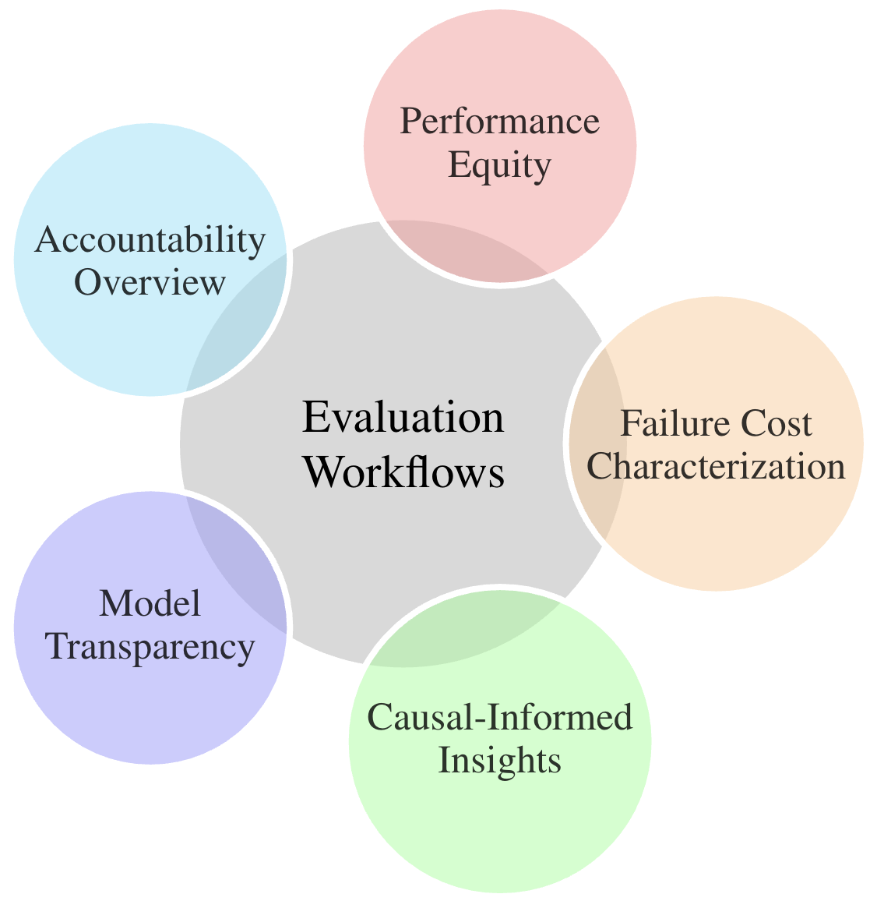

RAIEv organizes workflows into 5 categories:

1. **Accountability Overview** evaluations capture aggregate performance (leveraged in traditional evaluations) and targeted evaluations of model performance across critical subsets or circumstances. 
    - Aggregate metric summary (as used in traditional evaluations)
    - Global sensitivity analyses 
    
2. **Performance Equity** evaluations provide insight on whether there is an equitable *reliability* and *robustness* across circumstances in which models perform (*e.g.,* specific locations) as well as characteristic-based groupings of model inputs (*e.g.,* variants of inputs like long vs short documents). 
    - Faceted metrics across key circumstances
    - Identification of significant performance variation
    - Relative comparisons across key circumstances identifying circumstances or subsets with significant differences in model success/failure/confidence
    - Targeted sensitivity analyses 
    
3. **Failure Cost Characterization** evaluations distinguish errors based on failure costs. 
    - Highlighting prevalence of *high impact errors* and their associated downstream costs (*e.g.,* introduction of noise vs. reduction of recall, selection of incorrect intervention, etc.
    - Distinguishing between model errors that are high versus low confidence outputs 
    - Characterizing the *reliability* of uncertainty (or confidence/probability) measure(s) provided by the model and alignment with correctness of model outputs, *i.e.,* whether it would be a relevant measure for calibrating appropriate trust by end users. 
     
     
4. **Causal-Informed Insights** workflows provide insight on model performance on unseen or underrepresented circumstances using causal discovery and inference methods.
    
5. **Model Transparency** evaluations outline exploratory error analysis workflows that expand on those described above for holistic *understanding of model behavior* based on input-output relationships introducing transparency (of varying degrees) to even black box systems.  
     
     
